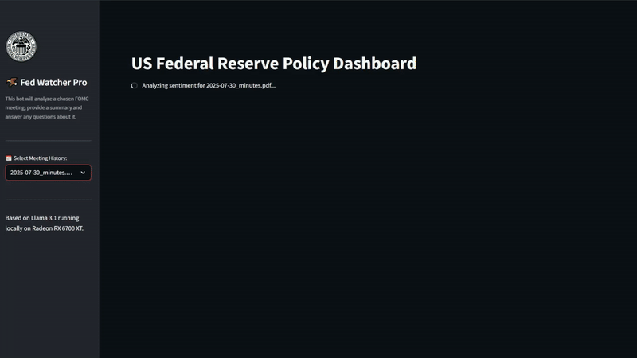

<h1 align="center">Hi there, I'm Samuel Garcia 👋</h1>
<h3 align="center">Data Scientist | ML Engineer | Finance & Risk Analytics</h3>

  
  
  

---

### 📖 My Story

💼 **Where I come from:** I spent the last 7 years in financial services, handling P&L reconciliation, identifying multimillion-euro accounting discrepancies, and monitoring AML/KYC compliance. 

🔭 **Where I am now:** I realized the most valuable part of my financial work was the automated data pipelines I built to solve those problems. I have since transitioned into machine learning, applying my domain expertise to build production-grade forecasting and risk systems.

🌱 **What I am learning right now:** * Deepening my knowledge of **LLMs and NLP** for macroeconomic sentiment analysis.
* Expanding my MLOps toolkit (Docker, GitHub Actions, AWS) to ensure models are scalable and production-ready.

---

### 🛠️ Tech Stack

  

---

### 🚀 Project Showcase

<table>
  <tr>
    <td width="50%" valign="top">
      
       
      <h3>📈 Macro-Alpha Engine</h3>
      
A production-ready ML pipeline predicting S&P 500 directional movement. Uses an ensemble of XGBoost and PyTorch LSTMs.

      

        
        
        
      

      <a href="https://github.com/samf0rd/macro_alpha">View Repository →</a> | <a href="https://www.samvgarcia.com">Live App →</a>
    </td>
    <td width="50%" valign="top">
      
       
      <h3>🦅 Fed-Watcher AI</h3>
      
An NLP system designed to analyze Federal Reserve communications and macroeconomic fundamentals. It quantifies "hawkish/dovish" sentiment text into actionable time-series features to predict interest rate shifts.

      

        
        
        
      

      <a href="https://github.com/samf0rd/fed-watcher-ai">View Repository | <a href="https://fed-watcher-ai.streamlit.app/">Live App →</a>
    </td>
  </tr>
</table>

---

<b>🗂️ Click to expand: Additional Projects & Explorations</b>

 
<ul>
  <li><b><a href="https://github.com/samf0rd/multi_asset_volatility">Multi-Asset Volatility Analysis</a>:</b> Statistical modeling of volatility forecasting and tail-risk correlations across diverse asset classes.</li>
  <li><b><a href="https://github.com/samf0rd/Home-Credit-Default-Risk">Home Credit Default Risk</a>:</b> An imbalanced classification project predicting loan repayment capabilities using advanced sampling techniques.</li>
  <li><b><a href="https://github.com/samf0rd/Corporaci_n_Favorita_Grocery_Sales">Corporación Favorita Grocery Sales</a>:</b> Time-series forecasting and EDA applied to large-scale retail store sales prediction.</li>
</ul>

---
