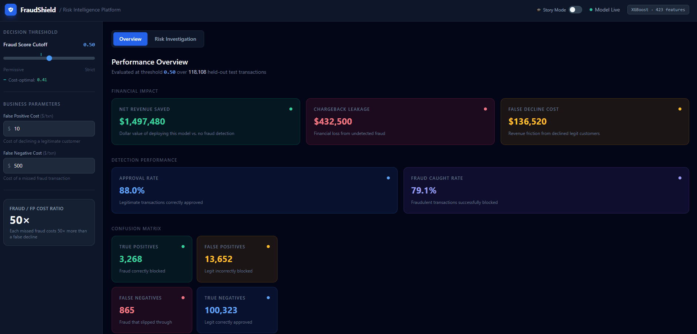
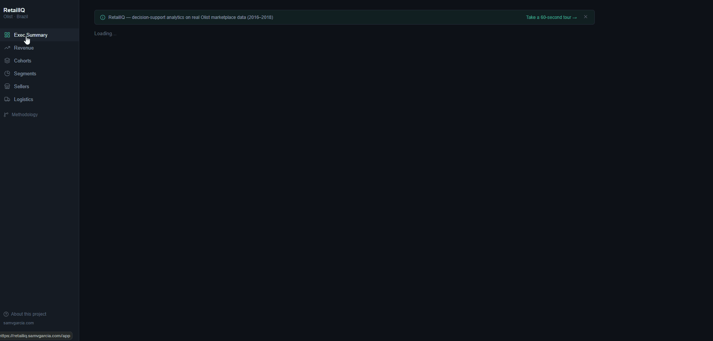
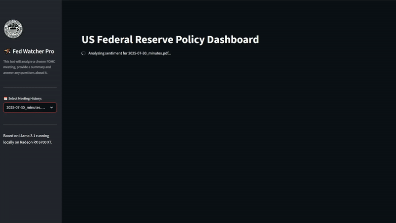
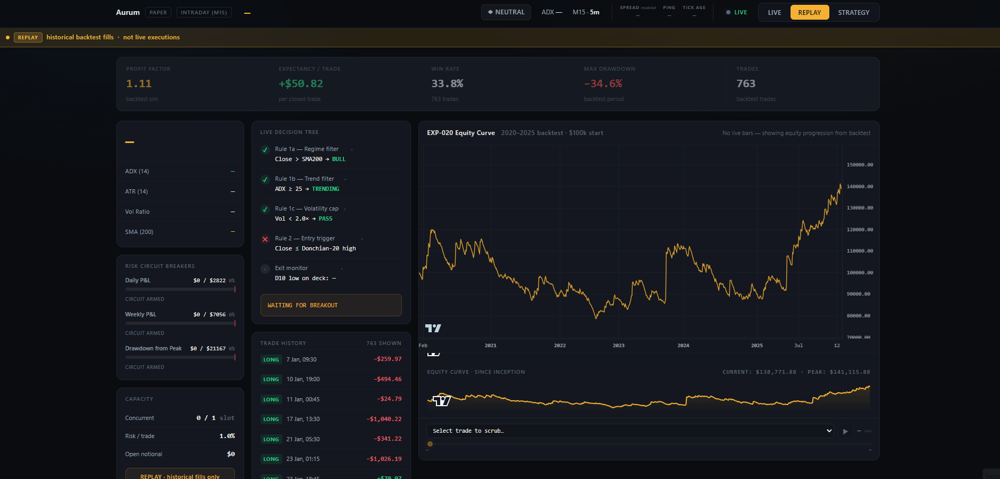

<h1 align="center">Hi there, I'm Samuel Garcia 👋</h1>
<h3 align="center">Data Scientist | ML Engineer | Finance & Risk Analytics</h3>

  
  
  

---

### 📖 My Story

💼 **Where I come from:** Financial markets professional with 7 years across P&L reconciliation, risk, and capital-markets operations — now combining that domain depth with Python, SQL, and machine learning to automate financial workflows and turn complex data into decisions.

🔭 **Where I am now:** I realized the most valuable part of my financial work was the automated data pipelines I built to solve those problems. I have since transitioned into machine learning, applying my domain expertise to build production-grade forecasting, trading, and risk systems.

🛠️ **What I do:**
* Financial analysis & reporting (P&L, reconciliation, variance breakdown, break resolution)
* Data engineering & automation (Knime ETL, SAP BI4 queries, Power Query — replacing manual work over 2M+ row datasets)
* Machine learning (time-series forecasting, classification, fraud/anomaly detection, risk scoring)
* MLOps & deployment (Docker, AWS, GitHub Actions, MLflow)
* Explainable AI (SHAP) for high-stakes financial decisions

🌱 **What I am learning right now:**
* Building end-to-end financial pipelines, dashboards, and ML engines that turn raw market/business data into decision-ready tools.
* Expanding my MLOps toolkit (Docker, GitHub Actions, AWS) to ensure models are scalable and production-ready.

---

### 🛠️ Tech Stack

  

---

### 🚀 Project Showcase

<table>
  <tr>
    <td width="100%" valign="top">
      
       
      <h3>🛡️ FraudShield — Cost-Aware Fraud Detection</h3>
      
An end-to-end fraud detection system on 590K+ real transactions (IEEE-CIS), framed around the business cost of missed fraud vs. false alarms rather than raw accuracy. Lifted fraud recall from 38% to 79% (ROC-AUC 0.91) by tuning the decision threshold to minimize total financial loss. Served via FastAPI with a real-time React dashboard.

      

        
        
        
        
      

      <a href="https://github.com/samf0rd/fraudshield">View Repository →</a>
    </td>
  </tr>
</table>

<table>
  <tr>
    <td width="50%" valign="top">
      
       
      <h3>📈 Macro-Alpha Engine</h3>
      
A production ML pipeline forecasting S&P 500 directional movement from 40+ engineered macro/technical features (yield-curve spreads, rate lags, volatility). Ensemble of XGBoost and a PyTorch LSTM, with unsupervised HMM regime detection. Walk-forward validation prevents look-ahead bias; 50+ experiments tracked in MLflow.

      

        
        
        
        
      

      <a href="https://github.com/samf0rd/macro_alpha">View Repository →</a> | <a href="https://www.alpha.samvgarcia.com">Live App →</a>
    </td>
    <td width="50%" valign="top">
      
       
      <h3>🛒 RetailIQ — E-Commerce Intelligence Platform</h3>
      
A decision-support analytics platform on 98,699 real orders (Olist, Brazilian e-commerce). Full dbt lineage (staging → intermediate → marts) is exposed on every dashboard panel via a "View SQL" drawer, with an interactive dependency graph and SQL-proficiency index. Every business recommendation is hand-authored and quantified against a validated number — e.g. flagging 55 top-decile sellers carrying R$1.56M of GMV at elevated late-delivery risk — never AI-generated.

      

        
        
        
        
      

      <a href="https://github.com/samf0rd/retailiq">View Repository →</a>
    </td>
  </tr>
  <tr>
    <td width="50%" valign="top">
      
       
      <h3>🦅 Fed-Watcher AI</h3>
      
An NLP system analyzing Federal Reserve communications and macroeconomic fundamentals. Quantifies "hawkish/dovish" sentiment into actionable time-series features to anticipate interest-rate shifts, using LLMs for tone extraction.

      

        
        
        
      

      <a href="https://github.com/samf0rd/fed-watcher-ai">View Repository →</a> | <a href="https://fed-watcher-ai.streamlit.app/">Live App →</a>
    </td>
    <td width="50%" valign="top">
      
       
      <h3>⚡ Aurum — XAU/USD Algorithmic Trading System <em>(Work in Progress)</em></h3>
      
A fully systematic, rule-based trend-following algorithm for Gold, built to push production-systems engineering as far as possible: four decoupled engines (Strategy, Risk, Execution, Orchestrator) wired via dependency injection, fault-tolerant async execution, and a 22-experiment research program designed to break the strategy rather than confirm it. The honest finding so far — the edge is real but concentrated in three outlier macro events, and near-flat without them — is treated as the project's headline result, not a caveat. Actively being developed and refined.

      

        
        
        
        
      

      <a href="https://github.com/samf0rd/aurum">View Repository →</a> | <a href="https://gold.samvgarcia.com">Live App →</a>
    </td>
  </tr>
</table>

---

<b>🗂️ Click to expand: ML Learning Projects & Experiments</b>

 

Smaller-scope projects from earlier in my ML learning journey — kept here as a record of the fundamentals-building work behind the projects above.

<ul>
  <li><b><a href="https://github.com/samf0rd/Home-Credit-Default-Risk">Home Credit Default Risk</a>:</b> An imbalanced classification project predicting loan repayment capabilities using advanced sampling techniques.</li>
  <li><b><a href="https://github.com/samf0rd/Corporaci_n_Favorita_Grocery_Sales">Corporación Favorita Grocery Sales</a>:</b> Time-series forecasting and EDA applied to large-scale retail store sales prediction.</li>
</ul>

---
